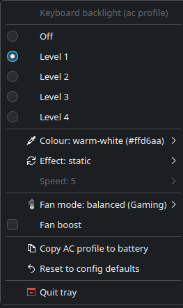

# uwbl – keyboard backlight & fan control for the Eluktronics RP-17 on Linux

A Linux port of the parts of the Windows **Eluktronics Control Center** (Uniwill
GamingCenter 1.1.0.55) that matter on the RP-17: the single-zone RGB keyboard
backlight (colour, 4 brightness levels, effects) and the fan mode (Gaming /
Beast, fan boost). It should also work on other Uniwill/Tongfang GK7NXXR boards
that use the same embedded controller.




```
┌────────────┐  D-Bus (system)  ┌──────────┐  sysfs LED / platform_profile  ┌──────────────────┐
│ uwbl (CLI) │─────────────────▶│  uwbld   │───────────────────────────────▶│ uniwill-laptop.ko│─▶ EC
│ uwbl-tray  │◀─────────────────│ (daemon) │                                │  (patched, DKMS) │
└────────────┘  StatusChanged   └──────────┘                                └──────────────────┘
```

| Component | What it is |
|---|---|
| `kernel/uniwill-laptop/` | Mainline `uniwill-laptop` driver + RP-17 DMI entry, `platform_profile` fan mode and `fan_boost` attribute. Installed with DKMS, shadows the (older) in-tree module. |
| `uwbl-core` | Library: sysfs backend, colour model, software effects (breathing / cycle / rainbow), TOML config, AC/battery profiles, controller. Fully unit-tested against a fake backend. |
| `uwbld` | Root daemon: owns the LED, applies the profile for the current power source, runs effects at ≤15 fps, re-applies after resume, follows the Fn brightness keys, optional idle-off, persists changes. Exposes `org.uniwill.Backlight1` on the system bus (polkit-protected). |
| `uwbl` | CLI client (`uwbl status|on|off|brightness|color|effect|speed|fan|boost|profile|watch`, `--json`). |
| `uwbl-tray` | KDE/Plasma tray icon (StatusNotifierItem): colour swatch icon, click to toggle, wheel for brightness, menu for everything else. Autostarts. |
| `docs/` | Reverse-engineering notes from the Windows package, hardware probe template. |
| `reference/` | The original Windows installer (not needed at runtime). |

## Install

Requirements: KDE neon / Ubuntu 24.04-ish, kernel headers, `dkms`, Rust toolchain (`rustup`).

```sh
sudo apt install dkms build-essential linux-headers-$(uname -r)
git clone https://github.com/michaelkamau/backlight-driver && cd backlight-driver
sudo ./install.sh          # builds, installs DKMS module, daemon, CLI, tray, systemd/D-Bus/polkit files
uwbl-tray &                # tray now; it autostarts on the next login
```

`install.sh` honours `SKIP_KERNEL=1` (don't touch the kernel module) and
`SKIP_BUILD=1` (use existing `target/release` binaries). `sudo ./uninstall.sh [--purge]`
removes everything.

### First run on new hardware

The kernel module has been built but **not yet verified on a live RP-17** (see
[docs/hardware-probe.md](docs/hardware-probe.md)). After installing, run

```sh
sudo ./scripts/probe.sh --test
```

It dumps DMI/ACPI/LED/hwmon information to `docs/hardware-probe-<date>.txt` and,
with `--test`, steps the keyboard through brightness 1–4 and red/green/blue/white/orange.
If the module refuses to load with "unsupported device", uncomment
`options uniwill-laptop force=1` in `/etc/modprobe.d/uniwill-laptop-uwbl.conf`.

## Usage

```sh
uwbl                         # status
uwbl color blue              # static colour (#rrggbb, r,g,b or a preset – see `uwbl colors`)
uwbl brightness 4            # 0–4, or up / down
uwbl effect breathing -s 7   # static | breathing | cycle | rainbow, speed 1–10
uwbl cycle red white blue    # colours for the cycle effect
uwbl fan performance         # balanced (Gaming) | performance (Beast)
uwbl boost on
uwbl profile show            # AC and battery profiles
uwbl profile copy            # AC -> battery
uwbl profile set battery '{"enabled":false}'
uwbl reset                   # back to /etc/uwbl/config.toml
uwbl watch --json            # stream changes
```

Changes made through the CLI/tray apply to the profile of the **current power
source** and are persisted in `/var/lib/uwbld/state.toml`. Defaults live in
`/etc/uwbl/config.toml` (`uwbld --print-config` prints a commented example):

```toml
[general]
idle_off_secs = 0          # turn off after N s without keyboard/mouse input (0 = never)
restore_on_resume = true
follow_hw_brightness = true # Fn keys update the profile

[profiles.ac]
enabled = true
brightness = 3
fan_mode = "balanced"
[profiles.ac.effect]
kind = "static"
color = "#0000ff"
speed = 5

[profiles.battery]
enabled = false            # Windows default: DCLight = 0
```

The Fn brightness keys keep working through the kernel driver; the daemon notices
(`brightness_hw_changed`) and updates the profile so the level survives a reboot.
KDE's on-screen brightness display works because the LED is a standard
`kbd_backlight` device.

### D-Bus API

`org.uniwill.Backlight1` at `/org/uniwill/Backlight1` on the system bus – see
`uwbl-dbus/src/lib.rs` for the full table. Mutating calls need the polkit action
`org.uniwill.backlight1.control` (allowed for active local sessions without a
password).

```sh
busctl call org.uniwill.Backlight1 /org/uniwill/Backlight1 org.uniwill.Backlight1 SetColor s red
busctl get-property org.uniwill.Backlight1 /org/uniwill/Backlight1 org.uniwill.Backlight1 Brightness
```

## Development

```sh
cargo test --workspace && cargo clippy --workspace --all-targets
# run everything unprivileged with a fake backend on the session bus:
cargo run -p uwbld -- --fake --session-bus --config /tmp/c.toml --state /tmp/s.toml &
UWBL_SESSION_BUS=1 cargo run -p uwbl -- effect rainbow
UWBL_SESSION_BUS=1 cargo run -p uwbl-tray
# kernel module only:
make -C kernel/uniwill-laptop
```

## Hardware notes (short version)

* RP-17 = Tongfang GK7NR0R (≈ TUXEDO Polaris 17 Gen1 AMD / XMG Apex 17 2020),
  Uniwill EC reached via ACPI `INOU0000` (`ECRR`/`ECRW`), WMI GUID `ABBC0F72…` for events.
* Keyboard backlight: EC `0x0769/6A/6B` R/G/B 0–50, `0x078C` bits 7:5 brightness 0–4,
  `0x0767` bit 5 apply. Windows FourZone/per-key paths are USB-HID and do not exist here.
* Fan: `0x0751` bit 4 TURBO (Beast), `0x0767` bit 2 fan-boost trigger, `0x0768` bit 2 status.
* Full register map and the Windows constants: [docs/windows-reverse-engineering.md](docs/windows-reverse-engineering.md),
  [docs/gcuservice_constants.txt](docs/gcuservice_constants.txt).

## License

GPL-2.0-only (the kernel driver is derived from GPL-2.0-or-later mainline code).
